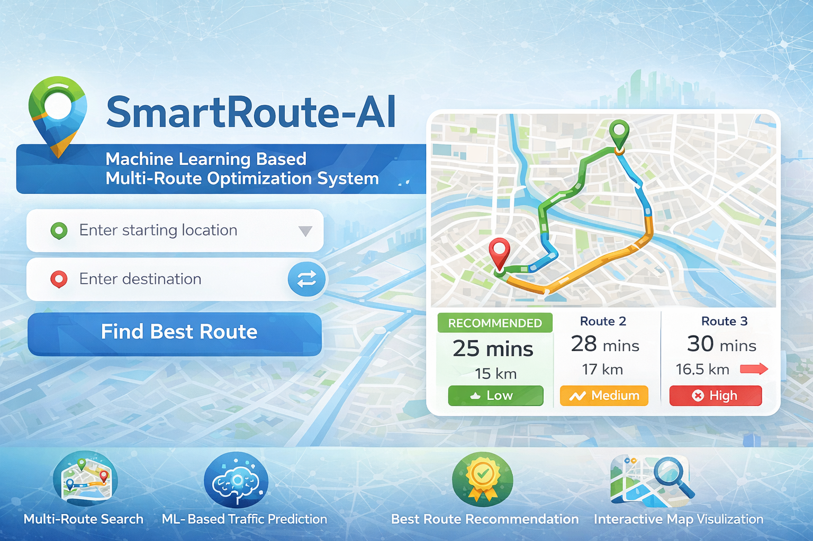

<p align="center">
  
</p>

<p align="center", size= 50px>
  🚦 SmartRoute-AI
</p>

### Intelligent Multi-Route Optimization System using Machine Learning

---

## 🌟 Overview

**SmartRoute-AI** is a full-stack intelligent route optimization system that not only finds multiple routes between two locations but also predicts real-world traffic conditions using Machine Learning to recommend the best route.

Unlike traditional navigation systems that rely only on distance or time, this project integrates **ML-based traffic prediction** to make smarter routing decisions.

---

## 🎯 Key Features

* 🔍 **Multi-route discovery** between source and destination
* 🧠 **Machine Learning-based traffic prediction** (Low / Medium / High)
* 🏆 **Automatic best route recommendation**
* 🗺️ **Interactive map visualization** using MapLibre GL
* 🔁 Swap start and destination instantly
* ⚡ Real-time routing using OSRM API
* 🎨 Clean and responsive UI
* 📊 Route comparison with time, distance, and traffic

---

## 🧠 How It Works

1. User enters **start and destination**
2. Backend fetches multiple routes using OSRM API
3. For each route, features are calculated:

   * Distance
   * Travel time
   * Average speed
   * Hour & day
   * Simulated vehicle density
4. ML model predicts traffic level
5. A scoring system ranks routes based on:

   * Travel time
   * Distance
   * Traffic severity (highest weight)
6. Best route is recommended and highlighted

---

## 🏗️ Tech Stack

### 🔹 Frontend

* HTML5
* CSS3
* JavaScript
* MapLibre GL JS

### 🔹 Backend

* Flask
* Flask-CORS
* Requests

### 🔹 Machine Learning

* Scikit-learn (Random Forest Classifier)
* Pandas
* NumPy

---

## 📂 Project Structure

```
SmartRoute-AI/
│
├── frontend/
│   ├── index.html
│   ├── styles.css
│   └── script.js
│
├── backend/
│   ├── app.py
│   ├── train_model.py
│   ├── model.pkl
│
├── dataset/
│   ├── generate_dataset.py
│   └── data.csv
│
├── requirements.txt
└── README.md
```

---

## ⚙️ Installation & Setup

### 1️⃣ Clone Repository

```
git clone https://github.com/your-username/SmartRoute-AI.git
cd SmartRoute-AI
```

### 2️⃣ Install Dependencies

```
pip install -r requirements.txt
```

### 3️⃣ Train Model (Optional)

```
cd backend
python train_model.py
```

### 4️⃣ Run Backend Server

```
python app.py
```

Server runs at:
👉 http://127.0.0.1:5000

### 5️⃣ Run Frontend

Open `frontend/index.html` in browser

---

## 🤖 Machine Learning Model

* **Algorithm:** Random Forest Classifier
* **Goal:** Predict traffic level (Low / Medium / High)
* **Features Used:**

  * Distance
  * Time
  * Average speed
  * Hour of day
  * Day of week
  * Vehicle density
  * Road type

### ⚡ Special Improvements

* Noise added to dataset for realism
* Label noise to avoid overfitting
* Controlled model depth for generalization

---

## 📊 Dataset

* Synthetic dataset generated using realistic logic:

  * Peak hour congestion
  * Speed variations
  * Vehicle density
* ~20,000 data samples

---

## 🔌 API Endpoints

### 📍 Geocode Location

```
GET /geocode?place=Kolkata
```

### 🚗 Get Optimized Routes

```
GET /route?start_lat=...&start_lng=...&end_lat=...&end_lng=...
```

---

## 🏆 Key Highlights

* 🚀 ML-integrated route optimization (beyond shortest path)
* 📊 Intelligent ranking using weighted scoring
* 🌐 Uses real-world routing APIs (OSRM)
* 🧩 Modular and scalable architecture
* 💡 Great for smart city / navigation systems

---

## 🔮 Future Enhancements

* 🌦️ Weather-based route impact
* 📡 Live traffic API integration (Google Maps / HERE)
* 📱 Mobile app version
* 👤 User authentication & route history
* 🚗 Real-time vehicle tracking
* 🧠 Deep learning-based prediction

---

## 👨‍💻 Author

**Soham Kundu**
B.Tech (Electronics & Computer Science) – KIIT
🏆 IoT Contest Winner
💻 Web Development & Machine Learning Enthusiast

---

## ⭐ Support

If you like this project:

👉 Give it a ⭐ on GitHub
👉 Share with your friends
👉 Use it in your projects

---

## 📜 License

This project is open-source and available under the MIT License.

---

## 🚀 Final Note

This project demonstrates how **Machine Learning + Web Development** can be combined to solve real-world problems like traffic optimization and smart navigation systems.

---
